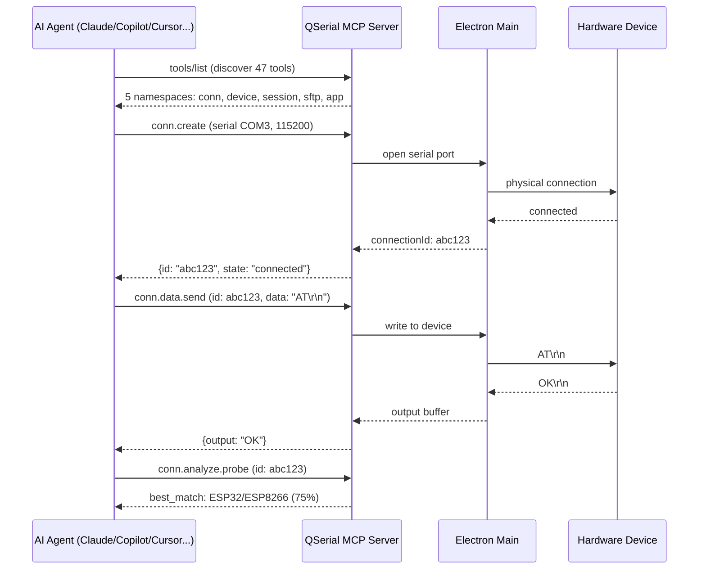

# QSerial

AI-powered serial console and device management tool. Built on Electron + MCP (Model Context Protocol).

## Architecture — How AI Interacts with Your Hardware



## Quick Start

```powershell
pnpm install
pnpm run dev      # dev mode with hot reload
pnpm start        # run pre-built app
pnpm run package:win  # build Windows installer + portable exe
```

## One-Click Build & Deploy (Linux / WSL2)

```bash
./build-win.sh              # build NSIS installer + portable exe + win-unpacked
./build-win.sh --deploy     # build, then upload artifacts to your Aliyun server
./build-win.sh --help       # show usage
```

Deployment uses `scp`/`ssh` to upload `release/*.exe` to the server. Configure
server info in `.env` (copy from `.env.example` and fill in `QSERIAL_HOST`,
`QSERIAL_USER`, `QSERIAL_WEB_ROOT`). Requires Node >= 20, pnpm, python3, and
SSH access to the target server.

## MCP Client Config

Add to your AI client's MCP configuration. Two transports are supported:

**Streamable HTTP**(推荐):JSON-RPC 请求与响应都在 POST 请求中完成

```json
{"mcpServers":{"qserial":{"type":"streamable-http","url":"http://127.0.0.1:9800/mcp"}}}
```

**SSE**:客户端先 `GET /sse` 建立事件流,JSON-RPC 响应经该流以 `message` 事件推送

```json
{"mcpServers":{"qserial":{"type":"sse","url":"http://127.0.0.1:9800/sse"}}}
```

### 鉴权(Token)

MCP 服务器默认关闭鉴权。一旦设置了访问令牌(或在非 localhost 监听时自动生成随机令牌),客户端必须在请求中携带 token:

- Streamable HTTP:请求头 `Authorization: Bearer <token>`
- SSE:URL 查询参数 `http://127.0.0.1:9800/sse?token=<token>`,或同样使用 `Authorization` 请求头

令牌可在 MCP 对话框的状态面板中查看。

### 监听地址

默认只监听 `127.0.0.1`(仅本机可访问)。需要局域网内其他机器接入时,在 MCP 对话框中把监听地址改为 `0.0.0.0`;此时若未手动设置 token,服务会自动生成一个随机 token,请从对话框状态面板或启动日志中获取。

## Capabilities

| Category | Tools | Description |
|----------|-------|-------------|
| Connection | `conn.create/list/disconnect/reconnect` | Manage serial, SSH, Telnet, PTY connections |
| Data I/O | `conn.data.send/read/expect/history` | Send commands, read output, pattern matching |
| Scripting | `conn.script.run/login` | Multi-step scripts, auto-login |
| Analysis | `conn.analyze.state/probe/report` | Device detection (21 types), state analysis |
| File Transfer | `sftp.*`, `conn.file.send` | SFTP, XMODEM/YMODEM |
| Monitoring | `conn.watch.start/stop`, `conn.record.*` | Pattern alerts, session recording |
| Device | `device.ports` | List available serial ports |

## Tech Stack

| Layer | Technology |
|-------|-----------|
| Desktop | Electron 35, React 18, TypeScript |
| Terminal | xterm.js 5 |
| Styling | Tailwind CSS |
| State | Zustand + immer |
| Protocol | MCP (Model Context Protocol) over Streamable HTTP / SSE |
| Testing | Vitest (135 tests) |
| Build | electron-builder, Vite, pnpm workspace |

## Project Structure

```
packages/
├── main/      # Electron main process, IPC handlers, MCP tools, services
├── renderer/  # React frontend (components, stores, i18n)
└── shared/    # TypeScript types and constants
plugins/       # Community plugins and device models
scripts/       # Build, deploy, packaging, icon scripts
```
